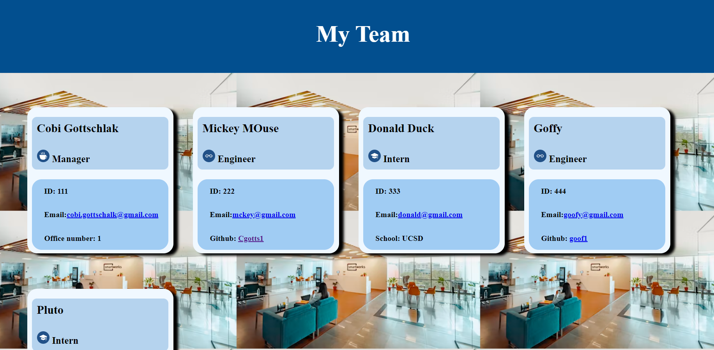
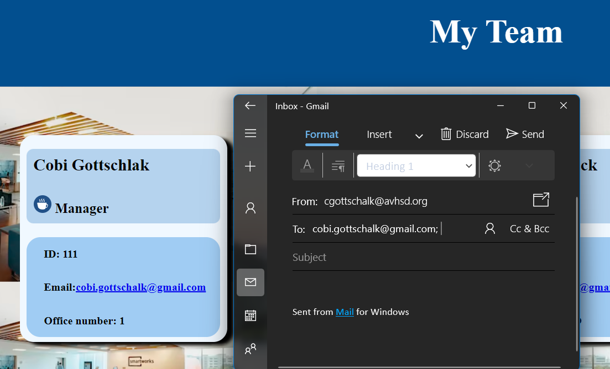
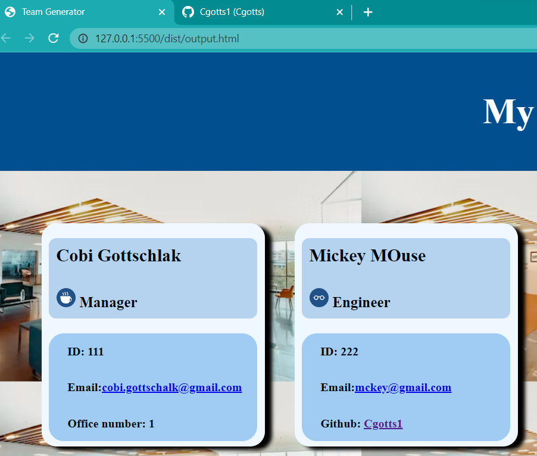
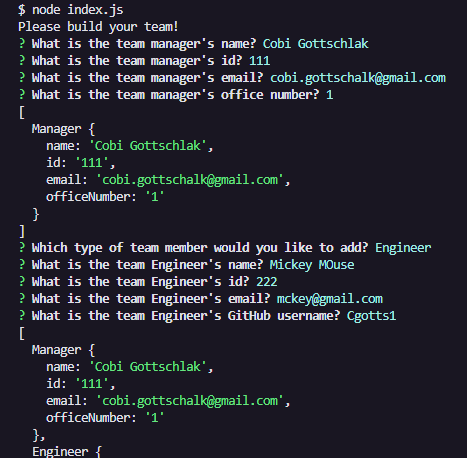
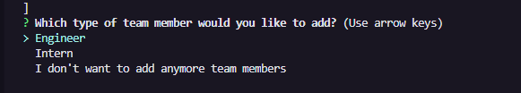

# Team-Profile-Generator

## <section id = "License">License</section>
 N/A
 

## <section id = "Description">Description</section>
This project assists users in creating team profiles for their workplace. Using the inquirer package and node.js, a series of questions begin by asking the user to create a manager, after which, they will be prompted of whether they would like to add an engineer or intern. Once the user has finished creating their team and has select the option for no more team members, an html page will be generated featuring the user's created team members. Tests for the application were done using jest.

Link to video: https://drive.google.com/file/d/1h6JLU5_bIjOT5hWXo3d54XxKFUUBkfhP/view

## Table of Contents
1.) <a href = "#License">License</a> 
2.) <a href = "#Description">Description</a> 
3.) <a href = "#Installation">Installation</a>  
4.) <a href = "#Usage">Usage</a> 
5.) <a href = "#Contributing">Contributing</a> 
6.) <a href = "#Tests">Tests</a> 
7.) <a href = "#Questions">Questions</a>

## <section id = "Installation">Installation</section>
Command to Install Dependencies: npm i

## <section id = "Usage">Usage</section>
Using the Repo: Users can create one manager and as many engineers/interns as they desire.

## <section id = "Contributing">Contributing</section>
Contributing to the Repo: N/A

## <section id = "Tests">Tests</section>
Command to Run Tests: jest

## <section id = "Questions">Questions</section>
If you have any questions, please feel free to contact me:   
1.) Github Username: Cgotts1  
2.) Email Address: cobi.gottschalk@gmail.com
